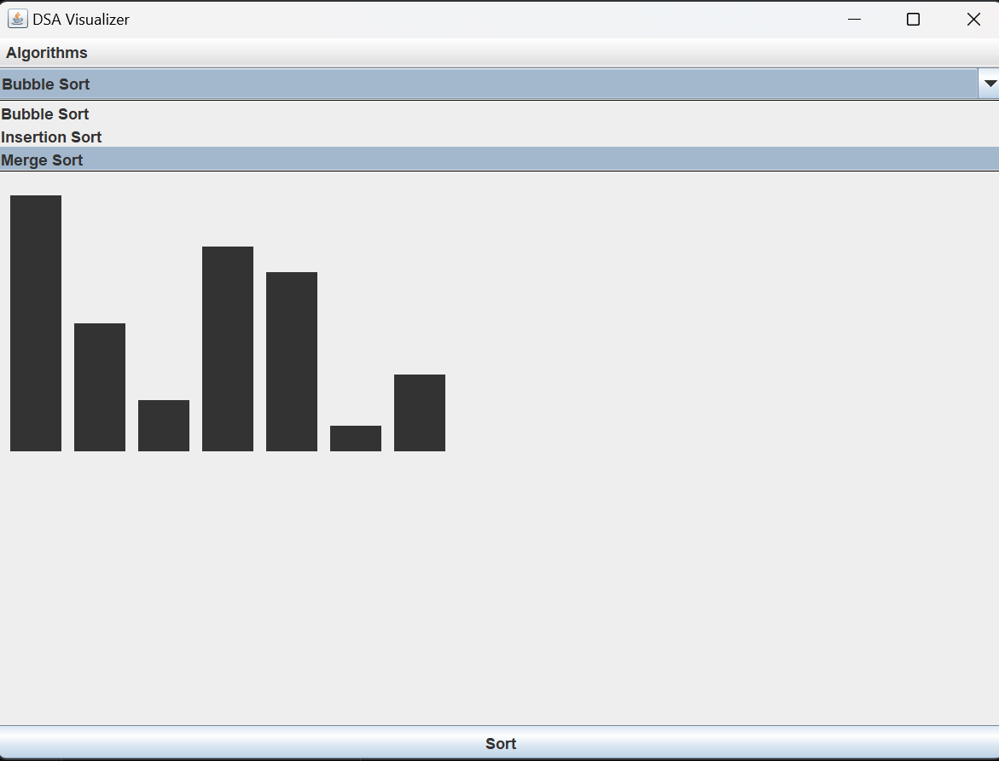
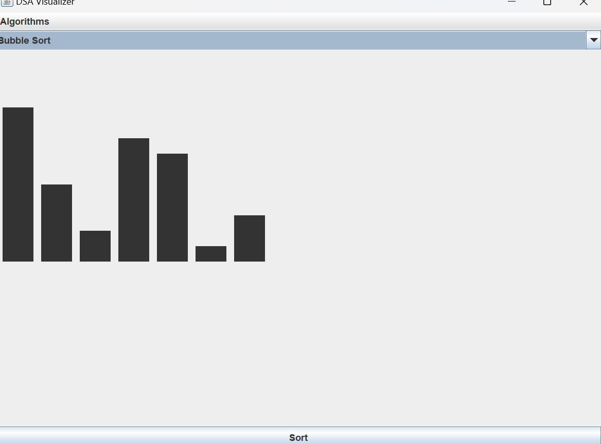

DSA Visualizer is a Java application that allows users to explore and understand data structures and algorithms interactively. It features visualizations for searching algorithms (Linear and Binary Search), and operations for stacks (Push, Pop, Peek) and queues (Enqueue, Dequeue, Peek).

# DSA Visualizer(Built with JAVA Language)

DSA Visualizer is a Java-based graphical application that allows users to interactively visualize various data structures and algorithms, including searching algorithms, stacks, and queues. This project aims to help users understand fundamental DSA concepts through visual representation and interactivity.

## Features

- **Searching Algorithms**:

  - Linear Search
  - Binary Search (requires a sorted array)

- **Stack Operations**:

  - Push
  - Pop
  - Peek

- **Queue Operations**:
  - Enqueue
  - Dequeue
  - Peek

## Technologies Used

- **Java**: The primary programming language used for the application.
- **Swing**: Java's built-in GUI toolkit for creating graphical user interfaces.

# Screenshots

# Usage

Searching Panel:

Enter a number in the input field.
Click "Linear Search" to perform a linear search.
Click "Binary Search" to perform a binary search (the array will be sorted before this operation).
Stack Panel:

Enter a number to push onto the stack.
Click "Push" to add the number to the stack.
Click "Pop" to remove the top element from the stack.
Click "Peek" to view the top element of the stack without removing it.
Queue Panel:

Enter a number to enqueue into the queue.
Click "Enqueue" to add the number to the queue.
Click "Dequeue" to remove the front element from the queue.
Click "Peek" to view the front element of the queue without removing it.

# Example

Here's how the interface looks when performing operations:

Searching: Enter a number and click the search button to see if it exists in the array.
Stack: Push elements onto the stack, pop elements off, and peek to see the top element.
Queue: Enqueue elements to the queue, dequeue them, and peek to see the front element.

# Acknowledgments

Inspired by the need for interactive learning tools for Data Structures and Algorithms.
Thanks to the Java community for providing the resources to build this application.

# License

This project is licensed under the [MIT License](https://docs.github.com/en/repositories/managing-your-repositorys-settings-and-features/customizing-your-repository/licensing-a-repository) . See the LICENSE file for more details.

# Suvam Mohapatra
